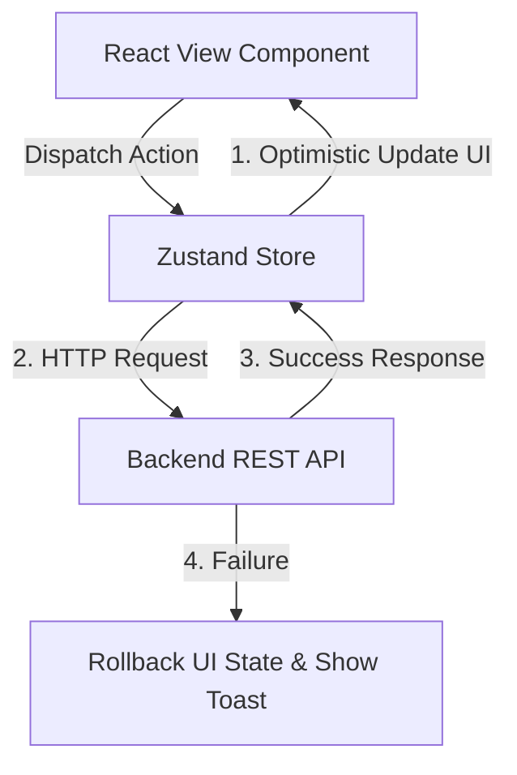
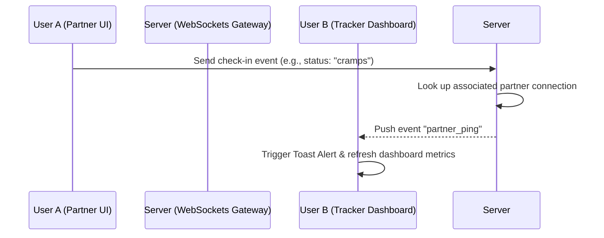

# MensFlow API & Backend Integration Blueprint 🚀

[← Back to README](file:///Users/david/Downloads/MensFlow/README.md) | [← Back to Project Overview](file:///Users/david/Downloads/MensFlow/docs/project_overview.md)

This document details the blueprint for migrating the MensFlow frontend architecture from a local-only (`localStorage` & simulated latency) environment to a live REST and WebSocket backend. Following this plan will ensure smooth integration with minimum disruption to the UX design system.

---

## 📖 Table of Contents
1. [State Architecture Migration Strategy](#-state-architecture-migration-strategy)
2. [Proposed API Endpoints Mapping](#-proposed-api-endpoints-mapping)
3. [Real-time Synchronization (From Web Storage to WebSockets)](#-real-time-synchronization-from-web-storage-to-websockets)
4. [Securing Chats & Passcode Encryption Policy](#-securing-chats--passcode-encryption-policy)
5. [Network Error Handling & Offline Fallbacks](#-network-error-handling--offline-fallbacks)

---

## 🔄 State Architecture Migration Strategy

Currently, MensFlow utilizes a local Zustand store with `persist` middleware. When integrating a backend, we must separate **local-only UI state** from **remote database state**.



### Zustand Store Refactoring (`src/store/useStore.ts`)
*   **Remove Persistence Middleware:** Strip `persist` from store keys that should be saved in the database (e.g., `logs`, `dashboard` metrics, `supportStreak`). Keep UI preferences (such as `sidebarCollapsed` or `themeMode`) in `localStorage`.
*   **Replace Simulated Latency:** Replace the existing `setTimeout` latency mocks with real HTTP network requests using `fetch` or `axios`.
*   **Keep the `isSaving` State:** Maintain the `isSaving` and loading indicators in the store to power the frontend loading spinners.

*Current Zustand Pattern:*
```typescript
addLog: async (date, symptoms) => {
  set({ isSaving: true })
  await new Promise(resolve => setTimeout(resolve, 800)) // Replace this
  // local update...
}
```

*Future Backend Pattern:*
```typescript
addLog: async (date, symptoms) => {
  set({ isSaving: true })
  try {
    const response = await fetch('/api/cycle/logs', {
      method: 'POST',
      headers: { 'Content-Type': 'application/json' },
      body: JSON.stringify({ date, symptoms })
    })
    if (!response.ok) throw new Error('Failed to save log')
    const savedLog = await response.json()
    set((state) => ({
      logs: [...state.logs.filter(l => l.date !== date), savedLog],
      isSaving: false
    }))
  } catch (error) {
    set({ isSaving: false })
    toast.error("Failed to sync symptoms with cloud database")
  }
}
```

---

## 📡 Proposed API Endpoints Mapping

The backend server should support the following REST endpoint structure:

### 1. Authentication (`/api/auth`)
*   `POST /api/auth/register` - Create user profile, typical cycle metadata.
*   `POST /api/auth/login` - Authenticate, returns JWT token.
*   `GET /api/auth/me` - Resolves active session data (hydrates `AuthProvider.tsx`).

### 2. User & Cycle Dashboard (`/api/dashboard`)
*   `GET /api/dashboard` - Fetches typical cycle configurations, last period start, and computed statistics.
*   `PATCH /api/dashboard` - Updates cycle parameters (re-calculates days dynamically in the backend).

### 3. Symptom Logs (`/api/cycle/logs`)
*   `GET /api/cycle/logs` - Retrieves historical logs (returns array of `SymptomLog`).
*   `POST /api/cycle/logs` - Creates or updates symptom entries for a specific ISO Date.
*   `DELETE /api/cycle/logs/:date` - Removes logs.

### 4. Partner Support Actions (`/api/support`)
*   `GET /api/support/streak` - Resolves current streak counts and last action dates.
*   `POST /api/support/actions` - Toggle state of completed gestures/support actions.

---

## ⚡ Real-Time Synchronization (WebSockets / SSE)

Currently, `SyncView.tsx` and `DashboardView.tsx` communicate across browser tabs using local storage events. For real-time updates across *different devices* (e.g. partner's phone and tracker's desktop), migrate to WebSockets or Server-Sent Events (SSE).

### WebSocket Architecture Pattern



### Frontend WebSocket Hook Setup (`src/hooks/usePartnerSocket.ts`)
Create a custom socket hook that runs on dashboard mount:

```typescript
import { useEffect } from 'react'
import { toast } from 'sonner'

export function usePartnerSocket(partnerId: string) {
  useEffect(() => {
    if (!partnerId) return

    const ws = new WebSocket(`${import.meta.env.VITE_WS_URL}/partner/${partnerId}`)

    ws.onmessage = (event) => {
      const data = JSON.parse(event.data)
      if (data.type === 'PARTNER_PING') {
        toast.info("Partner Update received!", {
          icon: "👋",
          description: `She is: "${data.label}" (${data.message})`,
          duration: 8000
        })
      }
    }

    return () => ws.close()
  }, [partnerId])
}
```

---

## 🔒 Securing Chats & Passcode Encryption Policy

In the local environment, the Locked Chats view writes messages directly to local storage. When moving to the cloud, chat privacy is paramount.

> [!IMPORTANT]
> To prevent unauthorized server access to private health logs or messages, implement **Client-Side Hashing & Encryption** before transmission.

*   **Encryption Key Generation:** Derive an AES encryption key on the client side using the user's secret passcode passcode.
*   **Pre-Upload Encryption:** Encrypt the messages array using `crypto.subtle` (AES-GCM) on the client before making the `POST /api/chats/locked` call. The backend stores only ciphertext blobs and is incapable of reading the contents.
*   **Decrypt on Load:** Decrypt the messages in memory only when the user enters the passcode inside `LockedChatsView.tsx`.

---

## 🛜 Network Error Handling & Offline Fallbacks

Health trackers must remain functional in poor connectivity settings (e.g., transit, offline zones).

*   **Optimistic UI Updates:** Immediately apply log entries to the UI (e.g. checkbox selections, cycle calendar changes) before the HTTP request returns. If the request fails, rollback the UI state and warn the user.
*   **IndexedDB Sync Queue:** In the event of network failure, serialize pending requests to an offline queue in IndexedDB. Register a service worker or window focus event listener to flush the sync queue once connection is recovered.
