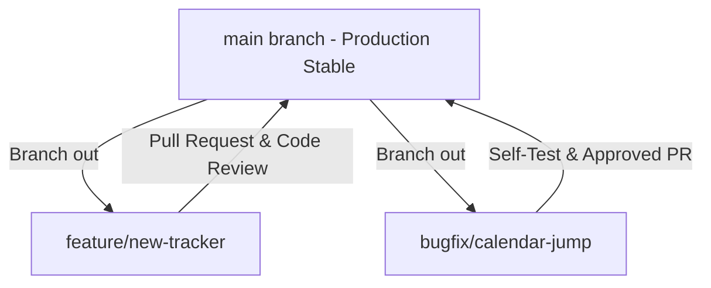

# MensFlow Developer Collaboration & Branching Guide 🌿

[← Back to README](../README.md) | [← Back to Project Overview](project_overview.md)

Welcome to the MensFlow development team! This document outlines our team's engineering standards, branching strategy, commit guidelines, code review protocols, and collaboration workflows. Following these policies ensures a clean, stable, and highly auditable codebase.

---

## 📖 Table of Contents

1. [Core Git Branching Model](#-core-git-branching-model)
2. [Branch Naming Conventions](#-branch-naming-conventions)
3. [Conventional Commit Messages](#-conventional-commit-messages)
4. [Pull Request (PR) & Code Review Process](#-pull-request-pr--code-review-process)
5. [Vibecoder Safety Guards & Local QA](#-vibecoder-safety-guards-&-local-qa)
6. [Design & UI Implementation Etiquette](#-design-&-ui-implementation-etiquette)
7. [Conflict Resolution & Merging Rules](#-conflict-resolution-&-merging-rules)

---

## 🔄 Core Git Branching Model

MensFlow follows a **GitHub Flow** branching strategy centered around a single, highly-stable primary branch.



### 1. Main Branch (`main`)

*   **Protection Rules:** Direct commits or pushes to the `main` branch are strictly prohibited and locked.
*   **Stability Standard:** `main` must always be deployable, pass all TypeScript compilations (`npm run build`), and be clean of linting errors (`npm run lint`).
*   **Continuous Deployment:** Every merge to `main` triggers a production build hook to Vercel/Staging.

### 2. Feature & Bugfix Branches

*   All work is developed in short-lived branches created from the latest `main`.
*   Developers should regularly merge or rebase `main` into their active branches to resolve conflicts early.

---

## 🌿 Branch Naming Conventions

We enforce a strict prefix structure to make branch listings readable and clear.

### Standard Branch Name Format

`type/short-description`

*   Use **lowercase lettering** exclusively.
*   Separate terms using **hyphens** (`-`). Do not use underscores or spaces.
*   Avoid generic names (e.g., `test`, `wip`, `daniella-changes`). Keep descriptions specific but short.

### Allowed Prefix Types

| Branch Type | Purpose / Description                                            | Example                     |
| :---------- | :--------------------------------------------------------------- | :-------------------------- |
| `feature/`  | Introduction of new features, views, or UI components            | `feature/hydration-tracker` |
| `bugfix/`   | Resolving an active bug or layout issue                          | `bugfix/locked-chats-reset` |
| `hotfix/`   | Immediate patch targeted for production errors                   | `hotfix/auth-session-crash` |
| `chore/`    | Structural dependencies, configurations, dependencies, cleanups  | `chore/update-zustand`      |
| `docs/`     | Editing or adding developer/medical documentation                | `docs/add-api-specs`        |
| `test/`     | Constructing or restructuring test suites and mock data          | `test/onboarding-flow`      |
| `refactor/` | Rearranging components or styles with zero functional difference | `refactor/stories-layout`   |
| `release/`  | Final staging checks before rolling out production versions      | `release/v1.2.0`            |

---

## ✍️ Conventional Commit Messages

We leverage the **Conventional Commits** specification to format commit logs. This facilitates automated changelog generation and simplifies audit reviews.

### Commit Format

`<type>(<optional scope>): <description>`

*   Use the **imperative, present tense** (e.g., "add", not "added").
*   Do not capitalize the first letter of the description.
*   No period (`.`) at the end of the commit summary.

### Standard Commit Types

*   `feat`: A new user-facing feature (e.g., `feat(chat): add temporary sandbox mode`).
*   `fix`: A bug resolution (e.g., `fix(theme): correct system preference check`).
*   `docs`: Documentation changes only (e.g., `docs(readme): add sync state details`).
*   `style`: Changes that do not affect code meaning (white-space, formatting, lint alignment).
*   `refactor`: A code change that neither fixes a bug nor adds a feature (e.g., `refactor(store): modularize state slice`).
*   `perf`: A code change that improves performance (e.g., `perf(calendar): memoize daily cell computations`).
*   `test`: Adding missing tests or correcting existing tests.
*   `chore`: Updating build tasks, configurations, or package dependencies (e.g., `chore(deps): bump tailwind to v4.3`).

---

## 🤝 Pull Request (PR) & Code Review Process

No code enters the `main` branch without peer validation.

### PR Creation Checklist

Before marking a PR as "Ready for Review," ensure:

1. **Branch is up-to-date:** Rebase or merge the latest `main`.
2. **Local checks pass:** Code compiles and lint checking is clean (`npm run lint` and `npm run build`).
3. **Aesthetic verification:** Verify layout responsiveness on both mobile screen widths and desktop layouts.

### Pull Request Description Template

When opening a PR, populate the description with the following outline:

```markdown
## 🌸 Description

[Provide a brief summary of the changes and the problem solved]

## 🛠️ Changes Made

- [ ] Added `HydrationView` container component under `src/views/`
- [ ] Updated Zustand store with `waterIntake` actions
- [ ] Configured new route and sidebar navigation link

## 📸 Visual Verification (If Applicable)

[Attach screenshots/recordings demonstrating responsive behaviors, light/dark themes, and micro-interactions]

## ✅ Reviewer Verification Checklist

- [ ] Strict TypeScript mode checks out
- [ ] Responsive navigation works on mobile simulations
- [ ] Dark Mode rendering checks out
```

### Reviewer Expectations

*   **Constructive Feedback:** Focus on code readability, performance, reuse of existing components, and compliance with the design tokens.
*   **Design Audit:** Ensure that new interactive UI components integrate the `.active-squish` scale class and follow the HSL color palette definitions.
*   **Approval Requirement:** At least **one approved review** is required from another developer before code merges.

---

<<<<<<< HEAD
=======
<<<<<<< HEAD
<<<<<<< HEAD
<<<<<<< HEAD
<<<<<<< HEAD
=======
>>>>>>> 5f2fc9a (docs: update README with detailed view documentation and add collaboration guide)
=======
>>>>>>> eb85cf2 (feat: add typecheck and doctor scripts to package.json and update development documentation and sidebar store access.)
>>>>>>> ed2de6f (feat: add typecheck and doctor scripts to package.json and update development documentation and sidebar store access.)
## 🛠️ Vibecoder Safety Guards & Local QA

Since a lot of code is updated via prompt-based flows ("vibecoding"), it is easy for small structural issues or incorrect typings to slip through. We maintain **three automated safety guards** to keep the workspace healthy. Run these before you commit, push, or request a review:

### Guard 1: Syntax & Code Style (`npm run lint`)

```bash
npm run lint
```

*   **What it does:** Runs ESLint to check syntax, formatting errors, unused imports, or code style violations.
*   **Why it matters:** Vibecoders often leave unused variables or minor syntax discrepancies. ESLint catches these instantly before staging.

### Guard 2: Strict Type Check (`npm run typecheck`)

```bash
npm run typecheck
```

*   **What it does:** Compiles the TypeScript project (`tsc -b --noEmit`) without writing any build artifacts to disk.
*   **Why it matters:** IDE type checkers can sometimes miss deeper type misalignments. Running this ensures that all components, store states, and routes conform to strict TypeScript interfaces.

### Guard 3: React Best Practices (`npm run doctor`)

```bash
npm run doctor
```

*   **What it does:** Runs `npx react-doctor@latest` to scan the codebase for React-specific anti-patterns, React 19 compatibility concerns, inefficient rendering traps, or duplicate dependencies.
*   **Why it matters:** Ensures custom hooks and component lifecycles remain highly performant and follow React's architectural principles.

---

### Final Compilation Check

Before pushing to production, execute:

```bash
npm run build
```

This runs the full build sequence (`tsc -b && vite build`) to create optimized static assets in the `dist/` directory. If this step succeeds, your feature is safe to deploy!
<<<<<<< HEAD
=======
=======
## 🛠️ Local Quality Assurance & Linting
<<<<<<< HEAD
<<<<<<< HEAD
=======
## 🛠️ Vibecoder Safety Guards & Local QA
>>>>>>> 26be10f (feat: add typecheck and doctor scripts to package.json and update development documentation and sidebar store access.)

Since a lot of code is updated via prompt-based flows ("vibecoding"), it is easy for small structural issues or incorrect typings to slip through. We maintain **three automated safety guards** to keep the workspace healthy. Run these before you commit, push, or request a review:

### Guard 1: Syntax & Code Style (`npm run lint`)
```bash
npm run lint
```
*   **What it does:** Runs ESLint to check syntax, formatting errors, unused imports, or code style violations.
*   **Why it matters:** Vibecoders often leave unused variables or minor syntax discrepancies. ESLint catches these instantly before staging.

<<<<<<< HEAD
=======
=======
=======
## 🛠️ Vibecoder Safety Guards & Local QA
>>>>>>> 62e37b9 (feat: add typecheck and doctor scripts to package.json and update development documentation and sidebar store access.)
>>>>>>> eb85cf2 (feat: add typecheck and doctor scripts to package.json and update development documentation and sidebar store access.)

Since a lot of code is updated via prompt-based flows ("vibecoding"), it is easy for small structural issues or incorrect typings to slip through. We maintain **three automated safety guards** to keep the workspace healthy. Run these before you commit, push, or request a review:

### Guard 1: Syntax & Code Style (`npm run lint`)
```bash
npm run lint
```
*   **What it does:** Runs ESLint to check syntax, formatting errors, unused imports, or code style violations.
*   **Why it matters:** Vibecoders often leave unused variables or minor syntax discrepancies. ESLint catches these instantly before staging.

<<<<<<< HEAD
>>>>>>> 5f2fc9a (docs: update README with detailed view documentation and add collaboration guide)
=======
<<<<<<< HEAD
>>>>>>> eb85cf2 (feat: add typecheck and doctor scripts to package.json and update development documentation and sidebar store access.)
*   **TypeScript Compilation:**
    ```bash
    npm run build
    ```
    This invokes `tsc -b` and compiles Vite modules. Ensure there are no type exceptions, implicit `any` fallbacks, or structural path mismatches.
<<<<<<< HEAD
>>>>>>> e3db77c (docs: update README with detailed view documentation and add collaboration guide)
=======
### Guard 2: Strict Type Check (`npm run typecheck`)
```bash
npm run typecheck
```
*   **What it does:** Compiles the TypeScript project (`tsc -b --noEmit`) without writing any build artifacts to disk.
*   **Why it matters:** IDE type checkers can sometimes miss deeper type misalignments. Running this ensures that all components, store states, and routes conform to strict TypeScript interfaces.

### Guard 3: React Best Practices (`npm run doctor`)
```bash
npm run doctor
```
*   **What it does:** Runs `npx react-doctor@latest` to scan the codebase for React-specific anti-patterns, React 19 compatibility concerns, inefficient rendering traps, or duplicate dependencies.
*   **Why it matters:** Ensures custom hooks and component lifecycles remain highly performant and follow React's architectural principles.

---

### Final Compilation Check
Before pushing to production, execute:
```bash
npm run build
```
This runs the full build sequence (`tsc -b && vite build`) to create optimized static assets in the `dist/` directory. If this step succeeds, your feature is safe to deploy!
>>>>>>> 26be10f (feat: add typecheck and doctor scripts to package.json and update development documentation and sidebar store access.)
=======
>>>>>>> 1d4910a (docs: update README with detailed view documentation and add collaboration guide)
<<<<<<< HEAD
>>>>>>> 5f2fc9a (docs: update README with detailed view documentation and add collaboration guide)
=======
=======
### Guard 2: Strict Type Check (`npm run typecheck`)
```bash
npm run typecheck
```
*   **What it does:** Compiles the TypeScript project (`tsc -b --noEmit`) without writing any build artifacts to disk.
*   **Why it matters:** IDE type checkers can sometimes miss deeper type misalignments. Running this ensures that all components, store states, and routes conform to strict TypeScript interfaces.

### Guard 3: React Best Practices (`npm run doctor`)
```bash
npm run doctor
```
*   **What it does:** Runs `npx react-doctor@latest` to scan the codebase for React-specific anti-patterns, React 19 compatibility concerns, inefficient rendering traps, or duplicate dependencies.
*   **Why it matters:** Ensures custom hooks and component lifecycles remain highly performant and follow React's architectural principles.

---

### Final Compilation Check
Before pushing to production, execute:
```bash
npm run build
```
This runs the full build sequence (`tsc -b && vite build`) to create optimized static assets in the `dist/` directory. If this step succeeds, your feature is safe to deploy!
>>>>>>> 62e37b9 (feat: add typecheck and doctor scripts to package.json and update development documentation and sidebar store access.)
>>>>>>> eb85cf2 (feat: add typecheck and doctor scripts to package.json and update development documentation and sidebar store access.)
>>>>>>> ed2de6f (feat: add typecheck and doctor scripts to package.json and update development documentation and sidebar store access.)

---

## 🎨 Design & UI Implementation Etiquette

MensFlow is defined by its premium aesthetics. When implementing UI features, follow these practices:

### 1. Mobile-First Responsive Focus

Always design templates mobile-first! Over 80% of our user traffic operates on mobile viewports.
*   Test viewports down to `320px` width.
*   Use tailwind grid or flex layouts with screen size prefixes (e.g., `grid-cols-1 md:grid-cols-2`).

### 2. Design System Tokens

Never write absolute color hex values or magic pixel padding inline.
*   **Colors:** Use CSS custom properties: `var(--mf-main-bg)`, `var(--mf-card)`, `var(--mf-accent)`, `var(--mf-text)`, `var(--mf-text-strong)`.
*   **Tactility:** Apply the `.active-squish` utility on buttons, interactive cards, and list elements to mimic a premium iOS native haptic click.
*   **Transitions:** Stagger item entry animations using tailwind-animate (`animate-in fade-in slide-in-from-bottom-4 duration-700`).

---

## ⚔️ Conflict Resolution & Merging Rules

When multiple developers are working on overlapping code paths, merge conflicts may occur:

### 1. Merging lockfiles

If conflicts occur in `package-lock.json` or `bun.lock`:
*   Never edit lockfiles manually.
*   Check out the version from `main`, reinstall dependencies (`npm install`), and commit the generated file.

### 2. Squash and Merge

*   We prefer **Squash and Merge** when closing PRs. This squashes all commits in the feature branch into a single, clean commit on the `main` branch.
*   The title of the squashed merge commit should follow the Conventional Commit standard.
