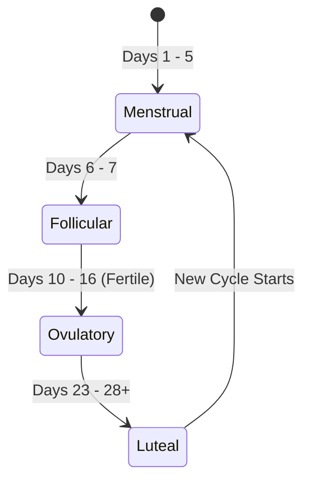
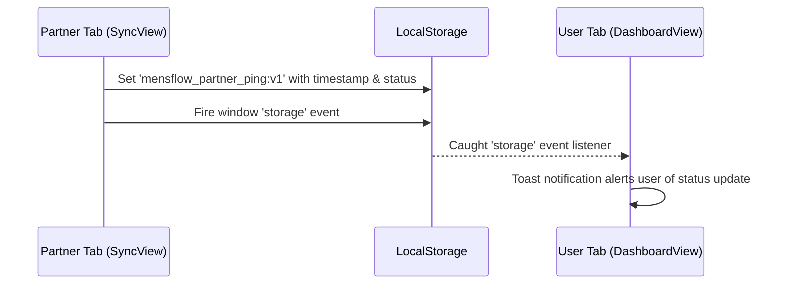

# MensFlow Cycle Calculations & State Architecture 🌸

<<<<<<< HEAD
<<<<<<< HEAD
[← Back to README](file:///Users/david/Downloads/MensFlow/README.md) | [← Back to Project Overview](file:///Users/david/Downloads/MensFlow/docs/project_overview.md)

=======
>>>>>>> 62e37b9 (feat: add typecheck and doctor scripts to package.json and update development documentation and sidebar store access.)
=======
[← Back to README](file:///Users/david/Downloads/MensFlow/README.md) | [← Back to Project Overview](file:///Users/david/Downloads/MensFlow/docs/project_overview.md)

>>>>>>> 86655d3 (docs: add navigation links and project overview reference to documentation and README)
This document provides a technical guide to the biological calculations, global state store, and real-time syncing mechanisms that drive the MensFlow application. 

---

## 📖 Table of Contents
1. [Cycle Calculation Engine](#-cycle-calculation-engine)
2. [Menstrual Cycle Phases](#-menstrual-cycle-phases)
3. [Global State Management (Zustand)](#-global-state-management-zustand)
4. [Partner Synchronization (Cross-Tab Messaging)](#-partner-synchronization-cross-tab-messaging)
5. [Locked Chats Security State](#-locked-chats-security-state)

---

## 🧮 Cycle Calculation Engine

MensFlow computes cycle schedules dynamically based on inputs configured in the settings page. The calculation functions are central to the app and reside in [cycleUtils.ts](file:///Users/david/Downloads/MensFlow/src/lib/cycleUtils.ts).

### The Cycle Day Calculation
To find out what cycle day the tracker is on, the app calculates the days elapsed since the user's last recorded period start date:

```typescript
export function computeCycleDay(startIso: string, cycleLen: number): number {
  const start = new Date(`${startIso}T12:00:00`)
  if (Number.isNaN(+start)) return 1
  const days = Math.floor((Date.now() - +start) / 86400000)
  const m = ((days % cycleLen) + cycleLen) % cycleLen
  return m + 1
}
```

*   **Modulo Anchor:** The modulo calculation prevents overflow or negative dates if cycle lengths shift.
*   **1-Indexed Return:** Biological cycles start counting from **Day 1** (rather than Day 0).

---

## 📅 Menstrual Cycle Phases

The cycle day maps directly to one of four biological phases. Each phase changes the dashboard colors, tips, and partner translation cards.



### Phase Mapping Logic
```typescript
if (cycleDay <= 5) return 'menstrual'
if (cycleDay <= 7) return 'follicular'
if (cycleDay >= 10 && cycleDay <= 16) return 'fertile' // (Ovulatory)
if (cycleDay >= 23) return 'luteal'
return 'follicular' // Fallback state
```

### Phase Metadata Mappings

| Phase ID | UI Label | Color Code (Hex) | Biological Characteristics & Focus |
| :--- | :--- | :--- | :--- |
| `menstrual` | **Menstrual** | `#f43f5e` (Rose) | Estrogen/progesterone low. focus on physical recovery, warmth, and rest. |
| `follicular` | **Follicular** | `#0d9488` (Teal) | Estrogen rises. Higher cognitive energy, planning, and creative initiatives. |
| `fertile` | **Ovulatory** | `#0ea5e9` (Sky) | Peak LH and estrogen. Highest physical stamina and social connection potential. |
| `luteal` | **Luteal** | `#d97706` (Amber) | Progesterone peaks then drops. Higher body heat, fatigue, needing calming environments. |

---

## ⚡ Global State Management (Zustand)

All inputs, preferences, symptom logs, and partnership stats are centralized in a single store file at [useStore.ts](file:///Users/david/Downloads/MensFlow/src/store/useStore.ts).

### 1. LocalStorage Persistence
The state is persisted locally using Zustand's `persist` middleware:
*   **Storage Key:** `mensflow-storage`
*   **Behavior:** Any changes to user names, symptoms logged, or settings are immediately serialized and saved.

### 2. Network Latency Simulation
To create a premium user experience with loading animations (e.g. spinner overlays on cards and headers), the store adds artificial delays on writing commands:
*   **Cycle Settings Save:** `1000ms` (1 second) delay.
*   **Daily Log Submissions:** `800ms` delay.

```typescript
updateDashboard: async (patch) => {
  set({ isSaving: true })
  await new Promise(resolve => setTimeout(resolve, 1000)) // Simulate network lag
  set((state) => ({
    dashboard: { ...state.dashboard, ...patch },
    isSaving: false
  }))
}
```

### 3. Support Actions & Streaks
The partner support checklist tracks consecutive days of support:
*   **Daily Reset:** `checkAndResetDailyActions()` resets the checklist if the day changes.
*   **Streak Accumulation:** If a support action is completed on consecutive days, `supportStreak` increments. If a day is missed, it resets to `0`.

---

## 🚀 Partner Synchronization (Cross-Tab Messaging)

Since MensFlow is a collaborative partner application, it supports synchronized data transmissions. 

To simulate real-time notifications without a backend server, the app uses a **reactive local storage listener system**:



### Implementation Details:
1.  **Broadcasting Status:** In [SyncView.tsx](file:///Users/david/Downloads/MensFlow/src/views/SyncView.tsx), when sending a check-in, the selected option is stored under the key `mensflow_partner_ping:v1`:
    ```typescript
    localStorage.setItem('mensflow_partner_ping:v1', JSON.stringify(pingData))
    window.dispatchEvent(new Event('storage')) // Force listener trigger in the same browser window
    ```
2.  **Receiving Status:** In [DashboardView.tsx](file:///Users/david/Downloads/MensFlow/src/views/DashboardView.tsx), an event listener watches for local storage updates:
    ```typescript
    window.addEventListener('storage', handlePingEvent)
    ```
    If `mensflow_partner_ping:v1` changes, it checks the timestamp against the last processed ping to prevent duplicate warnings, and fires a `sonner` toast notification containing the partner's status.

---

## 🔒 Locked Chats Security State

For conversations that require extra privacy, the app isolates messages into a locked workspace.

### 1. Storage Isolation
*   **Standard Chats:** Message states are stored within standard session components.
*   **Locked Chats:** Messages are read from and written to a separate localStorage key `mensflow_locked_chats`.

### 2. Lockout and Verification Flow
*   **Passcode Lock:** If `privacyLockChats` is true, the user must input their passcode to set `isUnlocked` to true in [LockedChatsView.tsx](file:///Users/david/Downloads/MensFlow/src/views/LockedChatsView.tsx).
*   **Recovery Safeguard:** If a passcode is forgotten and three incorrect attempts are entered, the view displays the "Security Question" recovery layout, prompting the user for the answer configured in settings.
