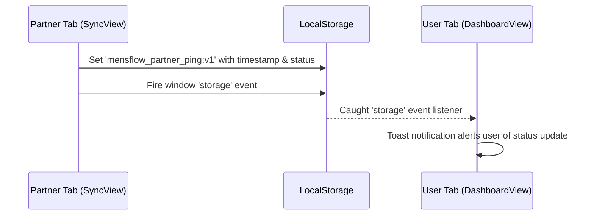

# MensFlow Cycle Calculations & State Architecture 🌸

[← Back to README](file:///Users/david/Downloads/MensFlow/README.md) | [← Back to Project Overview](file:///Users/david/Downloads/MensFlow/docs/project_overview.md)

This document provides a technical guide to the biological calculations, global state store, and real-time syncing mechanisms that drive the MensFlow application.

---

## 📖 Table of Contents

1. [Cycle Calculation Engine](#-cycle-calculation-engine)
2. [Menstrual Cycle Phases](#-menstrual-cycle-phases)
3. [Global State Management (Zustand)](#-global-state-management-zustand)
4. [Partner Synchronization (Cross-Tab Messaging)](#-partner-synchronization-cross-tab-messaging)
5. [Symptom Logs System](#-symptom-logs-system)
6. [Locked Chats Security State](#-locked-chats-security-state)

---

## 🧮 Cycle Calculation Engine

MensFlow computes cycle schedules dynamically based on inputs configured in the settings page. The calculation functions are central to the app and reside in [cycleUtils.ts](../frontend/src/lib/cycleUtils.ts).

### The Cycle Day Calculation

To find out what cycle day the tracker is on, the app calculates the days elapsed since the user's last recorded period start date:

```typescript
export function computeCycleDay(startIso: string, cycleLen: number): number {
  const safeCycleLen = Math.min(60, Math.max(15, Math.round(cycleLen || 28)))
  const start = new Date(`${startIso}T12:00:00`)
  if (Number.isNaN(+start)) return 1
  const days = Math.floor((Date.now() - +start) / 86400000)
  const m = ((days % safeCycleLen) + safeCycleLen) % safeCycleLen
  return m + 1
}
```

*   **Cycle Length Clamp:** `safeCycleLen` constrains input to 15-60 days with default 28
*   **Noon Timestamp:** Date parsed with T12:00:00 to avoid timezone edge cases at midnight
*   **Modulo Anchor:** Prevents overflow or negative dates if cycle lengths shift
*   **1-Indexed Return:** Biological cycles start counting from Day 1

---

## 📅 Menstrual Cycle Phases

The cycle day maps directly to one of four biological phases. Each phase changes the dashboard colors, tips, and partner translation cards.

The actual implementation in `cycleUtils.ts` uses cycle-length-aware thresholds:

```typescript
export function getPhaseFromDay(cycleDay: number, cycleLen = 28): CyclePhase {
  const safeCycleLen = Math.min(60, Math.max(15, Math.round(cycleLen || 28)))
  const periodLength = safeCycleLen <= 24 ? 4 : safeCycleLen >= 36 ? 6 : 5
  const ovulationDay = Math.max(periodLength + 5, safeCycleLen - 14)
  const fertileStart = Math.max(periodLength + 1, ovulationDay - 4)
  const fertileEnd = Math.min(safeCycleLen, ovulationDay + 2)
  const lutealStart = fertileEnd + 1

  if (cycleDay <= periodLength) return 'menstrual'
  if (cycleDay >= fertileStart && cycleDay <= fertileEnd) return 'fertile'
  if (cycleDay >= lutealStart) return 'luteal'
  return 'follicular'
}
```

**Calculation logic:**
- Period length adapts: 4 days (cycles ≤24), 5 days (cycles 25-35), 6 days (cycles ≥36)
- Ovulation fixed ~14 days before cycle end
- Fertile window: 4 days before through 2 days after ovulation
- Luteal phase: days after fertile window until cycle ends

### Phase Metadata Mappings

| Phase ID | UI Label | Color Code (Hex) | Background | Description |
| :--- | :--- | :--- | :--- | :--- |
| `menstrual` | **Menstrual** | `#f43f5e` | `rgba(244, 63, 94, 0.1)` | Estrogen/progesterone low. focus on physical recovery, warmth, and rest. |
| `follicular` | **Follicular** | `#0d9488` | `rgba(13, 148, 136, 0.1)` | Estrogen rises. Higher cognitive energy, planning, and creative initiatives. |
| `fertile` | **Ovulatory** | `#26899e` | `rgba(38, 137, 158, 0.1)` | Peak LH and estrogen. Highest physical stamina and social connection potential. |
| `luteal` | **Luteal** | `#d97706` | `rgba(217, 119, 6, 0.1)` | Progesterone peaks then drops. Higher body heat, fatigue, needing calming environments. |

---

## ⚡ Global State Management (Zustand)

All inputs, preferences, symptom logs, and partnership stats are centralized in a single store file at [useStore.ts](../frontend/src/store/useStore.ts).

### 1. LocalStorage Persistence

The state is persisted locally using Zustand's `persist` middleware:
*   **Storage Key:** `mensflow-storage`
*   **Behavior:** Any changes to user names, symptoms logged, or settings are immediately serialized and saved.

### 2. Persistence Strategy

State persistence is handled by the `isLocalOnly` flag in settings:

- **Authenticated + Remote storage:** API calls sync to backend, state updates optimistically
- **Authenticated + `privacyStrictLocalOnly = true`:** State changes stored in memory/localStorage only  
- **Unauthenticated (guest):** All state remains in memory, can be promoted to backend on login

### 3. Support Actions & Streaks

The partner support checklist tracks consecutive days of support:
*   **Daily Reset:** `checkAndResetDailyActions()` resets the checklist if the day changes.
*   **Streak Accumulation:** If a support action is completed on consecutive days, `supportStreak` increments. If a day is missed, it resets to `0`.

---

## 🚀 Partner Synchronization (Cross-Tab Messaging)

Since MensFlow is a collaborative partner application, it supports synchronized data transmissions. 

To simulate real-time notifications without a backend server, the app uses a **reactive local storage listener system**:



### Implementation Details:

1.  **Broadcasting Status:** In [SyncView.tsx](../frontend/src/views/SyncView.tsx), when sending a check-in, the selected option is stored under the key `mensflow_partner_ping:v1`:
    ```typescript
    localStorage.setItem('mensflow_partner_ping:v1', JSON.stringify(pingData))
    window.dispatchEvent(new Event('storage')) // Force listener trigger in the same browser window
    ```
2.  **Receiving Status:** In [DashboardView.tsx](../frontend/src/views/DashboardView.tsx), an event listener watches for local storage updates:
    ```typescript
    window.addEventListener('storage', handlePingEvent)
    ```
    If `mensflow_partner_ping:v1` changes, it checks the timestamp against the last processed ping to prevent duplicate warnings, and fires a `sonner` toast notification containing the partner's status.

---

## 📊 Symptom Logs System

Logs are managed through the Zustand store at [useStore.ts](../frontend/src/store/useStore.ts). Each log entry contains:

```typescript
export type SymptomLog = {
  date: string           // ISO date string (YYYY-MM-DD)
  symptoms: string[]     // Array of symptom IDs
  water?: number         // Daily water intake in ml
  weight?: number        // Daily weight in kg
  lhLevel?: string | null // LH hormone level indicator
  mucus?: string | null  // Cervical mucus observation
}
```

### Log Storage Behavior

- **Authenticated users:** Logs are synced to backend via `logsApi.upsert()` which performs POST to `/api/cycle/logs`
- **Local-only mode:** Logs persist in memory via Zustand store state only
- **Fetch:** `fetchLogs()` retrieves all historical logs via `logsApi.getAll()` GET request
- **Clear:** `clearLogs()` removes all logs (authenticated: API call + local state reset)

### Daily Metrics Update

`updateDailyMetrics()` updates water, weight, LH level, and mucus without modifying symptoms - preserves existing symptom array while updating numeric health metrics.

### Log Entry Merge Logic

When adding/updating logs, the system:
1. Checks for existing log on same date
2. Preserves existing values for any fields not explicitly provided
3. Merges water/weight/lhLevel/mucus defaults: 1000ml water, 62.5kg weight, null for hormone fields

### Symptom Categories

Symptoms are organized into five categories in `symptomsData.ts` (frontend/src/data/symptomsData.ts):

```typescript
export type SymptomCategory = 'Flow' | 'Mood' | 'Physical' | 'Lifestyle' | 'Other'

export type SymptomDef = {
  id: string      // kebab-case identifier
  label: string   // Human-readable name
  category: SymptomCategory
}
```

**Flow symptoms:** `flow-light`, `flow-medium`, `flow-heavy`
**Mood symptoms:** `mood-calm`, `mood-happy`, `mood-anxious`, `mood-sad`, `mood-irritable`
**Physical symptoms:** cramps, headache, bloating, fatigue, breast tenderness, acne
**Lifestyle symptoms:** sleep quality, BBT, sexual activity, pill taken
**Additional categories:** PCOS, endometriosis, and perimenopause niche conditions

### Phase Support Tasks

Each phase provides context-sensitive support suggestions via `getPhaseTasks(phase)` in cycleUtils.ts:

| Phase | Support Tasks |
| :--- | :--- |
| **Menstrual** | Prepare heating pad, Offer warm ginger tea, Handle physical chores |
| **Follicular** | Plan outdoor activity, Encourage social time, Surprise with gesture |
| **Fertile/Ovulatory** | Schedule date night, Leave post-it note, Initiate creative connection |
| **Luteal** | Pick up comfort snack, Hold off on heavy discussions, Run foot/back massage |

---

## 🔒 Locked Chats Security State

For conversations that require extra privacy, the app isolates messages into a locked workspace.

### 1. Storage Isolation

*   **Standard Chats:** Message states are stored within standard session components.
*   **Locked Chats:** Messages are read from and written to a separate localStorage key `mensflow_locked_chats`.

### 2. Lockout and Verification Flow

*   **Passcode Lock:** If `privacyLockChats` is true, the user must input their passcode to set `isUnlocked` to true in [LockedChatsView.tsx](../frontend/src/views/LockedChatsView.tsx).
*   **Recovery Safeguard:** If a passcode is forgotten and three incorrect attempts are entered, the view displays the "Security Question" recovery layout, prompting the user for the answer configured in settings.
