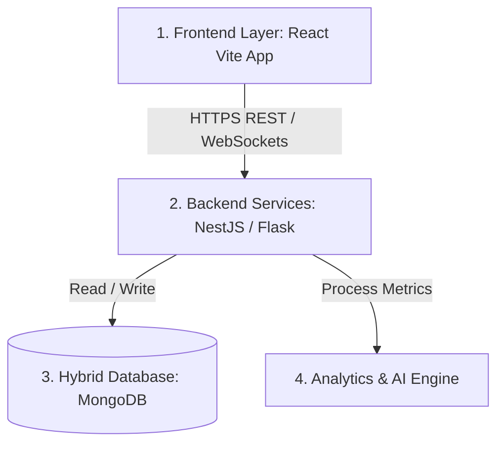

# MensFlow Project Overview & System Architecture 🌸

[← Back to README](file:///Users/david/Downloads/MensFlow/README.md)

This document establishes the high-level business vision, target audience context, and three-tier system architecture of the MensFlow platform. It aligns the frontend implementation with the future backend services, database schema, and machine learning processing engines.

### 💡 The Platform's Mission
MensFlow is designed to empower menstruating individuals with accurate biological insights while synchronously educating their partners. By doing so, it:
1. **Reduces Menstrual Literacy Gaps:** Provides an accessible, private environment for users (such as Ghanaian adolescents and young women) to learn about puberty, menstrual phases, and hormone cycles.
2. **Cultivates Empathetic Support:** Translates complex cycle changes into plain-language guidelines for partners, giving them direct, actionable checklists (e.g. preparing heating pads, adjusting home temperatures, picking up magnesium-rich foods).
3. **Ensures Robust Privacy:** Features passcode-protected private vaults for chats and a strict local-only storage toggle, keeping sensitive reproductive health data safe.

---

## 📖 Table of Contents
1. [Problem Statement & Social Impact](#-problem-statement--social-impact)
2. [Project Purpose & Core Objectives](#-project-purpose--core-objectives)
3. [System Architecture Layers](#-system-architecture-layers)
4. [Database & Analytics Engine Blueprint](#-database--analytics-engine-blueprint)
5. [Privacy, Data Security, & UX States](#-privacy-data-security--ux-states)
6. [Development Methodology & Team Roles](#-development-methodology--team-roles)

---

## 🇬🇭 Problem Statement & Social Impact

In Ghana, studies and everyday experiences show that many female adolescents still lack access to proper menstrual health education, even though topics related to reproductive health are included in the junior and senior high school curricula. Many young girls continue to have unanswered questions about menstruation, hormonal changes, body development, and reproductive wellness, with limited safe and reliable platforms where they can seek accurate information and guidance.

In many cases, mothers and guardians also lack the confidence or clinical knowledge to educate their daughters, causing adolescents to rely on myths, hearsay, and misinformation from peers or social media.

**MensFlow** solves this gap by providing an intelligent, personalized, and private reproductive health assistant that educates, guides, and empowers users to become confident and informed about their menstrual health journey.

---

## 🎯 Project Purpose & Core Objectives

MensFlow is a centralized digital health assistant designed to simplify menstrual and hormonal health management by:
*   Tracking menstrual cycles, symptoms, and active hormonal phases.
*   Predicting upcoming fertility windows and cycles.
*   Delivering science-backed, phase-specific recommendations.
*   Providing secure, conversational AI assistance for private inquiries.

### Core Objectives:
1.  **Efficient Logging:** Enable users to log cycle start dates, physical symptoms, and moods.
2.  **Biological Forecasting:** Provide accurate predictions of ovulation, cycle lengths, and hormone levels.
3.  **Personalized AI Guidance:** Deliver dietary, lifestyle, and exercise tips matched to active hormone levels.
4.  **Privacy-Centric Architecture:** Maintain secure data controls (e.g. encrypted local-only storage and locked chat modules).
5.  **Analytics and Trends:** Support aggregated population insights for broader reproductive research while protecting individual anonymity.

---

## 🏗️ System Architecture Layers

MensFlow is constructed across three primary system layers:

### 1. Frontend Layer (User Interaction)
Built using **React (Vite)** + **Tailwind CSS v4** + **TypeScript** for fast performance, responsive viewports, and mobile-first layouts.
*   **Key Features:** Visual menstrual tracker wheels, Recharts cycle trend lines, symptom logger interfaces, education articles, and the conversational companion chat portal.
*   **Aesthetics:** iOS-style card templates, glassmorphism mobile navigation bars, active click-squish scaling, and dynamic phase-shifting background ambient glows.
*   *See [docs/theme_and_design_system.md](file:///Users/david/Downloads/MensFlow/docs/theme_and_design_system.md) for style implementation details.*

### 2. Backend Services Layer (REST APIs)
Exposes endpoint routes to coordinate database writes and AI processes, powered by **NestJS** or **Flask**.
*   **Core Services:** Authentication service, Cycle & Logging service, Symptom analysis service, Notification Scheduler (sending pings), and AI Guidance handlers.
*   *See [docs/api_integration_blueprint.md](file:///Users/david/Downloads/MensFlow/docs/api_integration_blueprint.md) for API integration plans.*

### 3. Analytics & AI Processing Layer (Intelligence Engine)
Coordinates the mathematical modeling and predictive features:
*   **Cycle & Fertility Engine:** Calculates phases (Menstrual, Follicular, Ovulatory, Luteal) and predicts period start dates.
*   **Symptom Analysis AI:** Evaluates pain frequency, spots premenstrual symptom (PMS) patterns, and tracks mood-to-hormone correlations.
*   **Health & Guidance Engine:** Matches daily cycle segments with specific lifestyle advice and partner translation instructions.

---

## 🗄️ Database & Analytics Engine Blueprint

### Database Layer (MongoDB)
The backend utilizes **MongoDB** for flexible data management. This schema stores:
*   User profiles, typical period lengths, and configurations.
*   Historical logs (symptom IDs, custom symptoms, flows, moods).
*   AI-generated wellness predictions.
*   Aggregated metrics for health tracking reports.

---

## 🔒 Privacy, Data Security, & UX States

### Two Core User Experiences
1.  **Unauthenticated Experience (Guest Mode):** Allows users to explore navigation tabs, view general reproductive articles, test log metrics stored in local storage, and trial AI companion chats.
2.  **Authenticated Experience (Logged-In Mode):** Activates secure database saving, historical logs, cycle statistics over 6 months, partner-sync dashboards, and locked chat vaults.

### Privacy Measures
*   **Encrypted Connections:** All remote communications route over secure HTTPS protocols.
*   **Locked Chats module:** Restricts sensitive chat records behind custom local passcodes and security questions. 
*   **Restricted AI Training:** Restricts training models on chats generated inside temporary sandboxes.
*   *See [docs/routing_and_auth_guards.md](file:///Users/david/Downloads/MensFlow/docs/routing_and_auth_guards.md) for routing security guides.*

---

## 🤝 Development Methodology & Team Roles

MensFlow is developed using the **Agile software development methodology**, deploying features in incremental sprints. Each sprint includes designing, coding, linting, typechecking, and deploying.
*   *See [docs/collaboration_guide.md](file:///Users/david/Downloads/MensFlow/docs/collaboration_guide.md) for branching, testing, and PR guidelines.*

### 🌸 Project Team & Roles

*   **Liezah Attakorah-Amaniampong** — Project Manager
*   **Adwoa Yeboah** — Innovative Manager
*   **Abigail Edem Hayibor** — Product Designer
*   **Daniella Asiedu** — Product Designer and Developer
