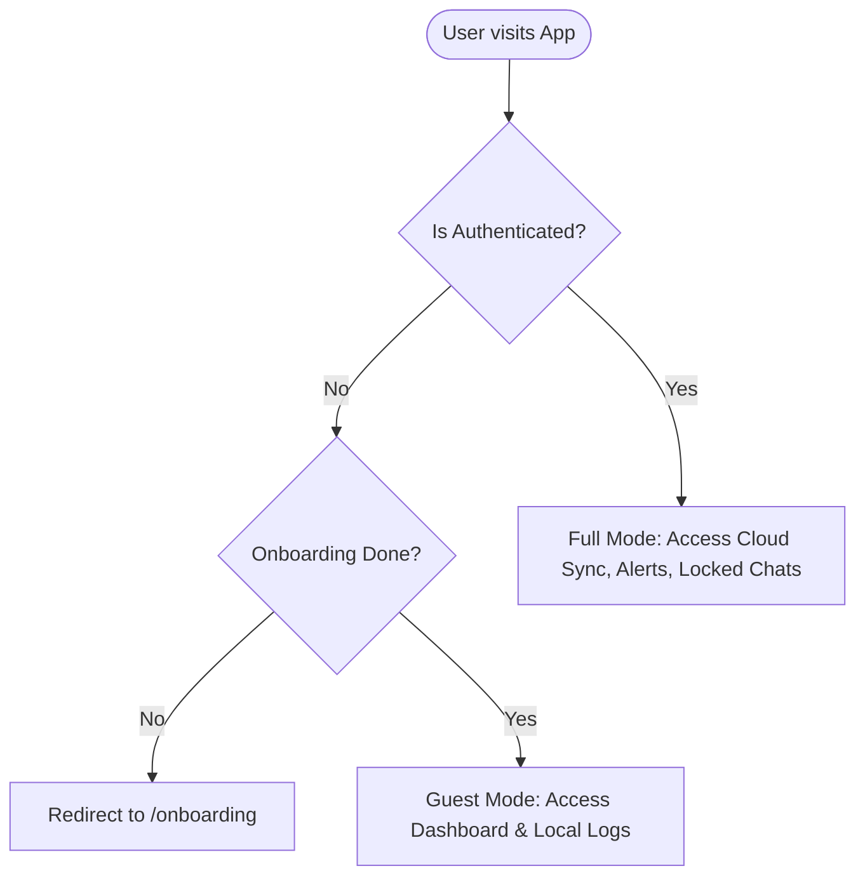

# MensFlow Routing, Authentication, & Navigation Guards 🔐

[← Back to README](file:///Users/david/Downloads/MensFlow/README.md) | [← Back to Project Overview](file:///Users/david/Downloads/MensFlow/docs/project_overview.md)

This document explains the router layout, authentication states, and private navigation guards implemented in MensFlow. Understanding this structure is essential for adding new views or modifying navigation links.

---

## 📖 Table of Contents
1. [Routing Framework (React Router v7)](#-routing-framework-react-router-v7)
2. [User Authentication Matrix](#-user-authentication-matrix)
3. [Guarded Routes & Fallback Portals](#-guarded-routes--fallback-portals)
4. [Authentication State Provider (`AuthProvider`)](#-authentication-state-provider-authprovider)

---

## 🚦 Routing Framework (React Router v7)

The application routing is configured inside [App.tsx](file:///Users/david/Downloads/MensFlow/src/App.tsx) and managed within the `MainShell` layout component. It uses lazy-loaded view components wrapped in `React.Suspense` to improve loading speeds.



---

## 📊 User Authentication Matrix

Depending on the user's login state (`isAuthenticated`) and onboarding completion status (`onboardingCompleted`), the router dynamically mounts different route templates:

| Route Path | Guest User State (Logged Out) | Authenticated User State (Logged In) |
| :--- | :--- | :--- |
| `/` | Redirects to `/onboarding` or loads Dashboard | Redirects to `/onboarding` or `/dashboard` |
| `/onboarding` | Accessible (Loads Onboarding questionnaire) | Accessible (Loads Onboarding questionnaire) |
| `/dashboard` | Redirects to `/` (Guest Dashboard) | Accessible (Loads User Dashboard) |
| `/ask` | Loads guest chat sandbox view (`LandingView`) | Loads authenticated database chat (`ChatView`) |
| `/settings` | Loads guest settings configuration panel | Loads authenticated user settings panel |
| `/sync` | Accessible (Local mock synchronization) | Accessible (Real-time partner synchronization) |
| `/locked-chats` | Not accessible | Protected by passcode verification |
| `/notifications`| Not accessible | Accessible (Alerts and support logs) |

---

## 🛡️ Guarded Routes & Fallback Portals

To prevent unauthorized guests from accessing screens that require cloud profiles, the app uses a fallback component generator called `guestPlaceholder`.

### 1. Guest Placeholder Function
If a guest attempts to visit a page that requires database persistence, they are displayed a placeholder view with an account creation call-to-action:

```typescript
const guestPlaceholder = (title: string, body: string) => (
  <PlaceholderView
    title={title}
    description={body}
    actionLabel="Log in"
    onAction={openAuthModal}
  />
)
```

### 2. Route Guard Example in `App.tsx`
Guarded routes are defined conditionally inside the `<Routes>` container:

```tsx
{!isAuthenticated ? (
  <>
    {/* Guest Paths */}
    <Route path="/settings" element={<SettingsView isGuest onLogin={openAuthModal} />} />
    <Route path="/history" element={guestPlaceholder('History / logs', 'Symptom history stays private to your account.')} />
  </>
) : (
  <>
    {/* Authenticated-Only Paths */}
    <Route path="/settings" element={<SettingsView onLogout={handleLogout} />} />
    <Route path="/locked-chats" element={<LockedChatsView />} />
  </>
)}
```

---

## 🔑 Authentication State Provider (`AuthProvider`)

The global user credentials, registration sessions, and modal states are distributed through the `AuthProvider` component located in [AuthProvider.tsx](file:///Users/david/Downloads/MensFlow/src/context/AuthProvider.tsx).

### Context Methods
Any component can access authentication triggers by calling the custom hook `useAuth()`:
*   `isAuthenticated: boolean` - Direct flag representing session presence.
*   `onboardingCompleted: boolean` - Flag representing if the cycle baseline has been configured.
*   `openAuthModal: () => void` - Global trigger to display the credentials modal overlay.
*   `login: (username: string) => void` - Registers user profile and establishes active session.
*   `logout: () => void` - Wipes active credentials, clears local sandbox, and redirects to home.
